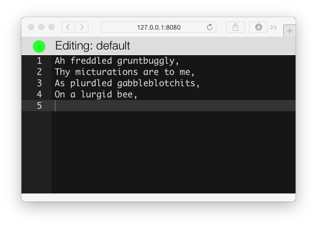

[](https://travis-ci.org/d6y/wootjs)

# WOOT with Scala.js

* Collaborative text editing, using the WOOT algorithm.
* Implemented in Scala, running on both the JVM and a JavaScript interpreter.

## For the Impatient

    $ sbt server/run

Then open _http://127.0.0.1:8080/_ to edit a document.

Open another browser at the same address, and you'll get the idea of collaboration.

## What is WOOT?

WOOT is a collaborative text editing algorithm, allowing multiple users ("sites") to insert or delete characters (`WChar`) from a shared document (`WString`). The algorithm preserves the intention of users, and ensures that the text converges to the same state for all users.

Its key properties are simplicity, and avoiding the need for a reliable network or vector clocks (it can be peer-to-peer).

The key references are:

* Oster _et al._ (2005) _Real time group editors without Operational transformation_, report paper 5580, INRIA - [PDF](http://www.loria.fr/~oster/pmwiki/pub/papers/OsterRR05a.pdf)

* Oster _et al._ (2006) _Data Consistency for P2P Collaborative Editing_, CSCW'06 - [PDF](http://hal.archives-ouvertes.fr/docs/00/10/85/23/PDF/OsterCSCW06.pdf)

WOOT stands for With Out [Operational Transforms](https://en.wikipedia.org/wiki/Operational_transform).

## Presentations

I've spoken about this project at Scala Days 2015: [there's video](https://www.parleys.com/tutorial/towards-browser-server-utopia-scala-js-example-using-crdts) and also [the slides](https://speakerdeck.com/d6y/towards-browser-and-server-utopia-with-scala-dot-js-an-example-using-crdts).


## This Project

This project contains a Scala implementation of WOOT. It has been compiled to JavaScript using Scala.js.
In other words, this is an example of sharing one implementation (the WOOT model) in both a JavaScript and Scala context.

WOOT is only the algorithm for text consistency.
You need to bring your own editor and network layer.

This example includes the [ACE](http://ace.c9.io/) editor, which is wired up to the
Scala.js implementation of WOOT locally within the browser.
Updates are sent over a web socket to a http4s server which also maintains a copy of the model, but on the JVM.



## Performance

This is a simple implementation that is slow for bulk actions (e.g., paste and cut).

To improve performance you will want to:

- measure what's slow for your scenarios
- batch messages between client and server (maybe)
- optimize the `trim`, `canIntegrate`, and `indexOf` methods.

I may get round to doing this at some point!

## What Happens When You Run the Web Server

Running the sever code will likely produce:

```
$ sbt "project server" run
[info] Loading global plugins from ...
[info] Loading project definition from wootjs/project/project
[info] Loading project definition from wootjs/project
[info] Set current project to woot
[info] Set current project to woot-server
[info] Fast optimizing wootjs/client/target/scala-2.11/woot-client-fastopt.js
[info] Running Main
2015-04-08 13:43:52 [run-main-0] INFO  WootServer - Starting Http4s-blaze WootServer on '0.0.0.0:8080'
...
```

Notice that the Scala.js compiler has run on the _woot-client_ project, to convert the client Scala code into JavaScript.  This JavaScript, _woot-client-fastopt.js_, is made available on the classpath of the server, so it can be included on the web page.  The web page is _server/src/main/resources/index.html_.

This reflects the structure of the project:

* _client_ - Scala source code, to be compiled to JavaScript.
* _server_ - Scala source code to run server-side, plus other assets to be served, such as HTML, CSS and plain old JavaScript.
* _wootModel_ - Scala source code shared by both the client and server projects. This is the WOOT algorithm, implemented once, used in the JVM and the JavaScript runtime.


## Exploring the Code

1. _server/src/main/resources/index.html_ is the starting point for the client. This folder also contains a trivial websocket JavaScript client (_ws.js_) and the editor bindings (_editor.js_).
2. _editor.js_ creates a local instance of the "woot client" and kicks off the web socket interactions.
3. _client/src/main/scala/client/WootClient.scala_ is the exposed interface to the WOOT model.  This is Scala compiled to JavaScript.
4.  _server/src/main/scala/main.scala_ is the server that accepts and broadcasts WOOT operations to clients.


## Tests

The tests for this project are implemented as [ScalaCheck](http://www.scalacheck.org/) properties.

### Running the tests in the JVM

    sbt> project wootModelJVM
    sbt> coverage
    sbt> test

Then open _wootModel/jvm/target/scala-2.11/scoverage-report/index.html_

## Publishing Woot Model

* Follow [bintray-sbt publishing instructions](https://github.com/softprops/bintray-sbt#publishing)
* `;wootModelJS/publish; wootModelJVM/publish`

It will now be available with

```scala
resolvers += "<repo-name>" at "http://dl.bintray.com/content/<repo-name>/maven",
libraryDependencies += "com.dallaway.richard" %%% "woot-model" % "<current-version>",
```

## Reference

* [Exporting Scala.js APIs to JavaScript](http://www.scala-js.org/doc/export-to-javascript.html)
* [Calling JavaScript from Scala.js](http://www.scala-js.org/doc/calling-javascript.html)
* [Semantics of Scala.js](http://www.scala-js.org/doc/semantics.html) - exceptions to the rule that Scala.js prorgrams behave the same as Scala on the JVM.
* [JavaScript interoperability ](http://www.scala-js.org/doc/js-interoperability.html) - including a list of [opaque types](http://stackoverflow.com/questions/27821841/working-with-opaque-types-char-and-long).
* [µPickle 0.2.8](http://lihaoyi.github.io/upickle/) - the JVM and JavaScript JSON/case class serialization library used in this demo.
* [Depending on Libraries](http://www.scala-js.org/doc/sbt/depending.html) -- both JavaScript and Scala.js.
* [http4s](http://http4s.org/) - the server used in this demo.

## Scala.js Learning Path

If you're new to Scala:

* [Creative Scala](http://underscore.io/training/courses/creative-scala/) - a free course from Underscore teaching Scala using drawing primitives backed by Scala.js.

And then...

* [Scala-js.org Tutorial](http://www.scala-js.org/doc/tutorial.html)
* [Hands-on Scala.js](http://lihaoyi.github.io/hands-on-scala-js/#Hands-onScala.js)


# License

Copyright 2015 Richard Dallaway

Licensed under the Apache License, Version 2.0 (the "License");
you may not use this file except in compliance with the License.
You may obtain a copy of the License at

http://www.apache.org/licenses/LICENSE-2.0

Unless required by applicable law or agreed to in writing, software
distributed under the License is distributed on an "AS IS" BASIS,
WITHOUT WARRANTIES OR CONDITIONS OF ANY KIND, either express or implied.
See the License for the specific language governing permissions and
limitations under the License.
